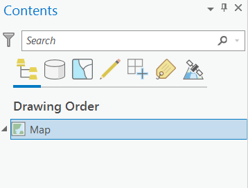
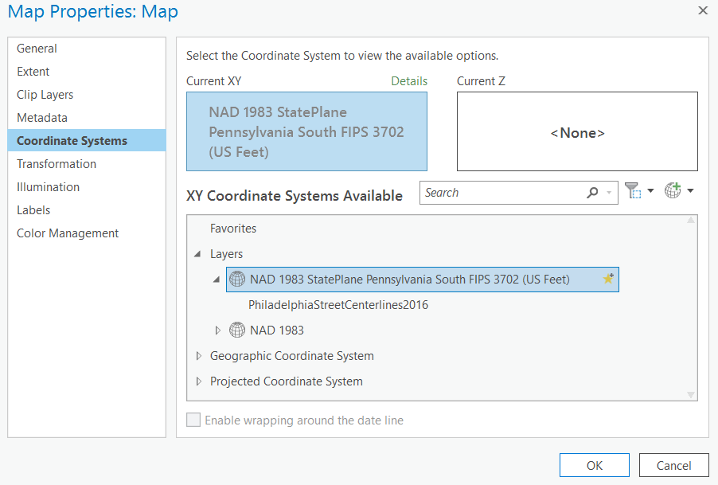
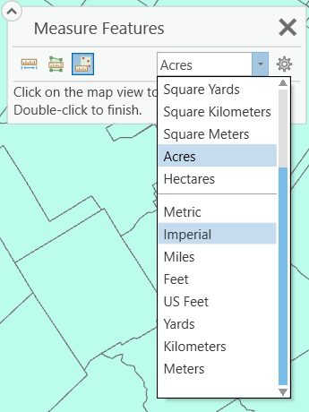
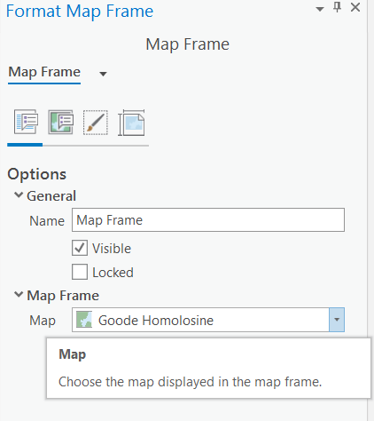
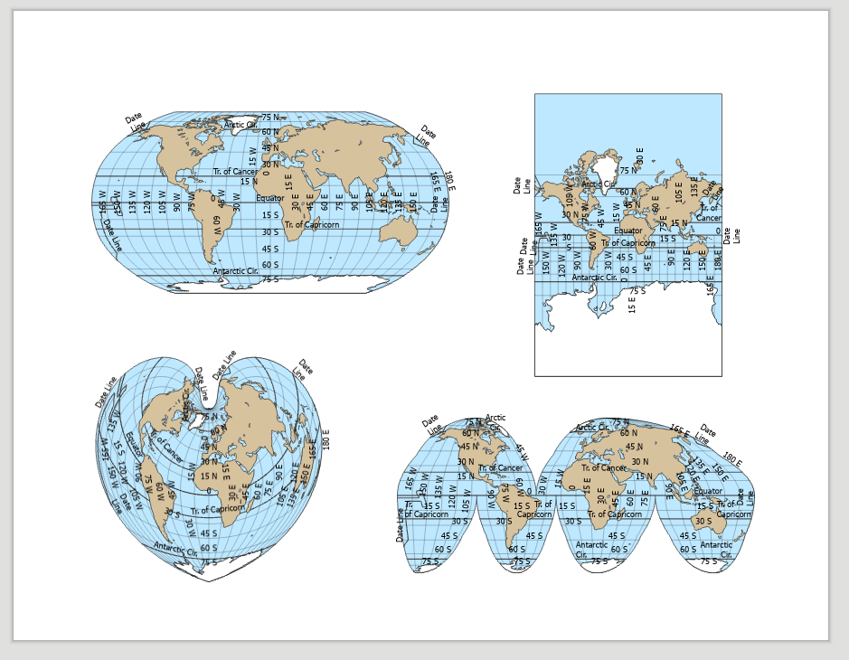

**Learning Objective**

To introduce concepts in map projection, and common operations in
working with coordinate reference systems (CRSs). To learn how to make
more complex map layouts for reference cartography. As a demonstration,
you will investigate properties of CRSs for large scale data in for
Philadelphia, Pennsylvania, as well as global data.

First, complete the tutorial by following the steps below. Then, using
the skills you’ve learned in the tutorial, complete the assignment given
following the tutorial.

# TUTORIAL

## Acquiring the Data

We will download GIS data from two websites:

  - [**Natural Earth**](http://www.naturalearthdata.com/) is an example
    of a single-purpose website. It provides global data, both physical
    (rivers, land masses) and cultural (political boundaries, populated
    places) specifically for cartography at medium to small scale.
  - [**PASDA** (The Pennsylvania Geospatial
    Clearinghouse)](http://www.pasda.psu.edu/), as we saw in the
    previous lab exercise, is a **geoportal**.

Search for and download the following data from [PASDA
(http://www.pasda.psu.edu/)](http://www.pasda.psu.edu/):

  - The Delaware River Watershed Municipalities 2016 data contributed by
    Natural Lands Trust: A municipality is a general purpose local
    government. A municipality may be a city, town, borough, village, or
    something else, with different states having slightly different
    terminology.
  - The Philadelphia Streets Centerline data contributed by the
    City of Philadelphia.

For the Natural Earth data, start at the [Natural Earth Features
page](http://www.naturalearthdata.com/features/)
(http://www.naturalearthdata.com/features/). Browse the different
categories of data. Think about the different uses for large, medium,
and small scale data. Look through the different files available in the
cultural, physical, and raster themes. After exploring the different
data available, download the following small scale (110m) physical
layers:

  - Land
  - Lakes (also called Lakes + Reservoirs)
  - Glaciated areas
  - Geographic Lines
  - 15-degree graticule
  - Bounding box (under Graticules)

Create a Lab 2 workspace folder. Move all the zip files to your
workspace folder. Unzip all of the zip files.

## Exploring Coordinate Reference Systems (CRSs) in the Catalog View

1.  Open ArcGIS Pro and create a new project with a **Map** template.
    Set the location to your workspace folder for Lab 2.  Do not create a new folder for this project.
2.  On the **View** tab on the ribbon, click the **Catalog** pane. The      **Catalog** pane
    has similar functionality to the catalog view, in a more compact side 
    pane that does not obstruct an active layout or map view. 
3.  In the **Catalog** pane, navigate to your workspace folder.  Add the    
    PhiladelphiaStreetCenterlines2016.shp shapefile to your map by dragging the file to the **Contents** pane or the map window (either will have the same effect). Remove the basemap layers from your map.
4.  Zoom in and explore the streets data – you can see the individual
    street segments.
5.  Right click on the streets layer on the **Contents** pane and go to 
    **Properties**.
6.  In the **Layer Properties** box, click on the **Source** tab, and then 
    click on the arrow to expand the **Spatial Reference** section. This contains information on the projection and coordinate system for the data file. Note the top line that specfies the Projected coordinate system: 
    `WGS 1984`.
    This is a code indicating the data file is in the WGS84. Other information below indicates the specific
    parameters for this CRS, i.e. the datum used (D WGS 1984), the angular unit (degree) and so on.
7.  Because the software has encoded the CRS information we say the
    projection and coordinate system are 'defined'.
8.  Close the **Layer Properties** box.
9.  Look to the bottom right corner of the map window. It should 
    show the coordinate position of the mouse in feet. This is the coordinate position in Pennsylvania State Plane. As you move the mouse, the coordinate position will change.  
10. Insert a new map and add the municipalities data file to the map. 
    Note this data
    set covers a much larger area than only Philadelphia, which is only
    one of 824 municipalities in the data file. 
11. Open the **Layer Properties** box and view the Spatial Reference. Note this
    data set is in `NAD 1983` – a different coordinate
    system from the Philadelphia street centerline data. `NAD 1983` is a
    **Geographic Coordinate System**, also known as decimal degrees or
    latitude/longitude – a spherical coordinate system.
12. Close the **Layer Properties** box. Note the coordinate position of 
    the mouse at the bottom of the view window is in decimal degrees.
    
13. Close ArcGIS Pro, and save the changes to your project.

## Understanding How the CRS is Encoded in the .prj File

1.  Open Windows File Explorer and navigate to your Lab2 workspace
    folder and into the folder containing the DRWI\_Municipalities2016
    files that compose the shapefile.
2.  Right click on the DRWI\_Municipalities2016.prj file and select **Edit with Notepad++**. (The .prj file can be viewed with *any* text editor.
    Notepad++ is installed on CLA computers, but if you are working
    elsewhere, you can open the file with Notepad, WordPad, etc.) Note
    the file is simply a text file that contains the CRS information:  
    `GEOGCS["GCS_North_American_1983", DATUM["D_North_American_1983",
    SPHEROID["GRS_1980",6378137.0,298.257222101]],
    PRIMEM["Greenwich",0.0], UNIT["Degree",0.0174532925199433]]`
3.  Close Notepad++. To illustrate how defining a projection works,
    delete the DRWI\_Municipalities2016.prj.
4.  Open ArcGIS Pro, and open the Lab2 project. Go to the map that
    contains the municipalities shapefile.
5.  Open the properties for the municipalities data and view the **Spatial 
    Reference**. Notice that the current coordinate system now
    indicates `Unknown Coordinate System`. This is because there is no .prj file to indicate the CRS. The projection and coordinate system are
    'undefined'. Close the properties box.
6.  Note that the municipalities data are still in the
    `NAD 1983` CRS – the software is simply unaware of
    that information because there is no .prj file.

## Handling Undefined Coordinate Reference Systems

Occasionally you will be supplied with data that lacks a CRS, as is the
case currently with the DRWI\_Municipalities2016 data, since we deleted
the .prj file. This is common with tabular data, which might have an X
and Y column, but not specify what they mean. Frequently it is easy to
identify latitude and longitude data by eye, and XY data with latitude
and longitude is very likely to have been gathered by GPS, and therefore
to be in the `WGS 1984` datum. If you don’t know the CRS you have to go
back to the source to see if you can find it. If not, you have to try
one that might be reasonable for the region or scale, and see if it
lines up with the rest of your data. This takes a lot of trial and error
and is something you will learn over years of practice.

It used to be somewhat common for shapefiles to get passed around
without the .prj file that stores the coordinate system metadata. Less
commonly, but still possible, you might get a shapefile (or other
spatial data) that just has the wrong CRS associated with it (probably
because the person responsible for it didn’t take this course).

To illustrate the problem with GIS data for which the CRS is undefined
we will visualize the street centerline data (which is defined in
Pennsylvania State Plane South CRS) and the municipalities data (which
is in decimal degrees, but currently undefined) together in ArcGIS.

1.  Go to the map that contains the street centerline data. Then 
    add the municipalities data.
2.  You should see an error message:  
    The message indicates that the CRS for the municipalities data set
    is undefined. 
3.  At this point, the software has included both data sets in the view
    window. But they are in completely different CRSs, and because the
    municipalities data CRS is undefined, the software cannot 'register'
    the layers so that they overlay properly in the map window.
4.  To visually demonstrate this, right click on the municipalities
    layer and click **Zoom to Layer**. You will see it appear. Do the same
    for the street centerlines data. You will also see it appear. So,
    both layers are available in the map window.
5.  Now click the **Full Extent** button 
 that zooms so that you can see all
    data sets in the view window simultaneously. Both data sets are
    displayed, but the municipalities is basically invisible, as the
    software is displaying it in the Pennsylvania State Plane CRS even
    though it is encoded in units of decimal degrees.
6.  In the next step, we will fix this by re-creating the .prj file for
    the municipalities data.
    
## Defining the CRS when the CRS is Undefined

1.  If a GIS data file has an undefined CRS, it must be defined. To
    illustrate this principle, we will define the CRS for the currently
    undefined municipalities data, which will recreate the .prj file. To
    do this we will use the **Define Projection** tool.
2.  Open the **Geoprocessing** pane by clicking on the **Tools** button
    
    with the red toolbox on it. Click on the **Toolboxes** tab in the pane.
3.  Navigate to Data Management Tools/Projections and Transformations
    and click on the **Define Projection** tool.
4.  In the **Define Projection** pane:
      - For **Input Dataset or Feature Class** choose the
        DRWI\_Municipalities2016 data set.
      - For **Coordinate System**, click on the globe button to the right.  In
        the **Coordinate System** dialog box, navigate to
        Geographic Coordinate Systems/North America/USA and territories
        and click `NAD 1983`. Press OK. The text box should now read
        `GCS\_North\_American\_1983`.
5.  Press Run.
6.  When the **Define Projection** function is finished close the 
    Geoprocessing pane. The two layers should now display together in 
    the map window.
7.  Open the properties for the municipalities data file. It should
    indicate the CRS is now defined as `NAD 1983`. Close
    the box.

## Making Use of 'On the Fly' Reprojection

Working with geographic data is often conceptualized as a 'layer cake',
with geographic data tables being treated as layers that are stacked on
top of each other.

In ArcGIS, spatial layers are added to a map. As we will see,
multiple map frames can be added to a single layout. 

1.  Open ArcGIS Pro.
2.  Create a new project with a **Map** template. Remove the basemap layers.

When you start ArcGIS with a blank map, the **Contents** pane 
will show a single map named 'Map'. This name is the same as the tab
name in the main window - when you add an additional map to your project,
a new tab will appear with a new name of 'Map1', 'Map2', and so on. The 
map name can be changed to something more descriptive by the user, and you
will probably want to do so if you create multiple maps.

Initially, a map has a default **CRS**, or coordinate \[reference\]
system, associated with it: `WGS 1984 Web Mercator (Auxilliary Sphere)`. This CRS comes from the default basemap layers. You can confirm this by checking the map properties.

3.  Double-click on the map name ('Map') in the **Contents** pane.
4.  Select the Coordinate Systems tab (if it is not already selected).
    You should see that the Current XY coordinate system is listed as `WGS 1984 Web Mercator (Auxilliary Sphere)`.

The first time you add non-basemap data, ArcGIS will update the map to match the CRS of that data.

5.  Add the DRWI\_Municipalities2016 data.
6.  Check the map properties. Note that the data frame now has
    coordinate system information. Specifically, it is using
    `NAD 1983`, a **GCS** (geographic coordinate system) based on the North
    American Datum 1983. This is another way of saying that the data is
    being shown using latitude and longitude (decimal degrees), the
    spherical coordinate system used for geographic locations, as if it
    were a planar CRS.
7.  Close the properties box.
8.  Hover the cursor near the center of the map. The coordinate values
    displayed at the bottom of the map window should be near -75
    and 40 decimal degrees. Whenever you see these lat-long values, you
    are in the region near Philly.
9.  Now add the Philadelphia streets centerlines above the municipalities
    layer. Notice the street
    centerline and municipalities are 'registered', i.e. they
    graphically overlay correctly. **Even though they are in different
    CRSs, since they are both defined correctly, ArcGIS can register
    them 'on the fly' by 'reprojecting' the street centerlines data into
    the decimal degrees CRS of the municipalities data.**
10.  Right-click on the streets layer and select Zoom To Layer from the
    popup menu.

You should be zoomed in to the Philadelphia area. Does the shape of
Philadelphia look strange? If you can’t tell, or if you are not familiar
with Philadelphia, zoom into part of the street grid, and notice that
the streets don’t meet at right angles (whereas in reality they do).
This is a consequence of viewing data using geographic coordinates
without projection.

11. Open the layer properties for the streets layer by double-clicking
    on the name in the **Contents** pane.
12. Click on the **Source** tab (if it is not already selected). Note that
    in addition to displaying the data type ('Shapefile Feature Class'),
    file location, and geometry type in the **Data Source** section, the dialog also shows the CRS the
    layer is stored in (in the Spatial Reference section), which in this case is 'Projected Coordinate System: NAD 1983 StatePlane Pennsylvania South FIPS 3702 (US Feet)'.

This shows us that the layer is stored in Pennsylvania State Plane
South, a CRS designed for high-accuracy, large-scale mapping appropriate
for local and state planning agencies. Many US state agencies require
land records and public infrastructure (such as roads and bridges) to be
stored and published using the appropriate State Plane CRS. If you are
mapping the Philadelphia area, Pennsylvania State Plane South will
usually be your best choice. However, if you are mapping a larger
region, distances and shapes will begin to distort rapidly as you move
away from southern Pennsylvania.

If Pennsylvania State Plane South is an appropriate CRS for Philadelphia
area data, why does the road grid look skewed? The reason is that the
data frame is still set to the `GCS NAD83` (lat-long), and ArcGIS is using 
'on the fly' reprojection to show the road network in NAD83. If you want
to view the data in SP Pennsylvania South, you can change the map
CRS.

13. Open the map properties and go to the **Coordinate Systems** tab.
    Notice the bottom pane has four folders: Favorites, Layers, Geographic
    Coordinate System, and Projected Coordinate System.
14. Expand the **Layers** folder. This will display the CRSes used by all
    loaded layers (in this case two).
15. Select `NAD 1983 StatePlane Pennsylvania South FIPS 3702 (US Feet)`
    from the list and hit OK.

The streets network and Philly borders should now look 'right'. This is
because SP Pennsylvania South is a **conformal** projection, which means
that it preserves local angles (often casually we say it 'preserves
shapes'). Conformal projections are ideal for route-finding, which is
why Google Maps uses 'Web Mercator', a conformal projection.

Note that changing the data frame properties CRS does not change the CRS
of the data themselves – only how they are displayed.

## Understanding Areal Distortion

All projections introduce distortions to **distance, direction, area,**
and/or **shape (local angles)**. To understand how projections distort
area (just one of these four properties), you are going to measure the
approximate area of Philadelphia in different projections. If you have
followed the steps above, the map should be in the SP
Pennsylvania South CRS. If it is not, please follow the steps above to
change the CRS of the data frame.

1.  Zoom in to Philadelphia and uncheck the streets layer in the **Contents** pane.
2.  On the **Map** tab, Click the **Measure** button . Your cursor should turn into a carpenter’s square,
    and the **Measure** panel should appear over your map.
3.  In the **Measure** panel, click the **Measure Features** button. .
4.  Click the dropdown menu, and set the
    measurement units to Acres.  
    
5.  Click on Philadelphia with the cursor. The **Measure** panel should now
    display the perimeter and area of Philadelphia – 91,347.93167 acres.
    Close the measure tool.
6.  Now let’s repeat the measurement in a different coordinate system
    for comparison. Change the map properties to the `NAD
    1983 UTM Zone 18N` CRS. You can search for this particular CRS by
    entering it into the search box in the **Map Properties**/**Coordinate System** tab and navigating to the CRS.
7.  Once you’ve changed the map CRS, measure the area of
    Philadelphia again in acres. The area should now read 91,277.485886
    acres. The point here is that changing the CRS can change
    measurements of area, as well as distance and directions between
    locations.

## Converting from One CRS to Another

Relying on 'on the fly' reprojection is fine for display purposes. But
it can lead to inaccuracies or anomalies when editing or performing
spatial analysis. (Read “[Coordinate Systems, Projections, and Transformations](https://pro.arcgis.com/en/pro-app/help/mapping/properties/coordinate-systems-and-projections.htm#ESRI_SECTION1_0E43C812FEA045699B26A20F5B8EB36E)”).
Therefore, it is usually a good idea to make sure that your data are in
the same CRS ***before*** adding data to ArcGIS Pro for analysis.

Here we will 'reproject' the municipalities data set to the UTM CRS.

1.  Open the **Geoprocessing** pane by clicking on the **Tools** button on the 
    **Analysis** tab. Navigate to Data Management Tools/Projections and
    Transformations. Click on the **Project** tool (pronounced 'pro-**JECT**').
2.  Look at the **Project** dialog. The settings that have a red asterisk
    on the left are required parameters. Note that at the top of the
    pane is a tool help button that will direct you to the online 
    documentation for this ArcGIS tool if you click on it. Hovering
    over the red asterisks next to the input parameters brings up
    a dialog box that gives a brief explanation of each parameter.
3.  Set the following parameters:
      - **Input Dataset or Feature Class**: Click the folder icon to the
        right, and navigate to DRWI\_Municipalities2016.shp and select
        it.
      - **Output Dataset or Feature Class**: Navigate to your workspace
        folder where DRWI\_Municipalities2016 resides. Name the file
        `DRWI_Municipalities2016_UTM18N.shp` and hit Save.
      - **Output Coordinate System**: Press the button to the right of
        the text box and search for UTM Zone 18N. Navigate to Projected
        Coordinate Systems/UTM/NAD 1983 and click NAD 1983 UTM Zone 18N.
4.  Press Run.

**It is very important that you understand the difference between the
Define Projection tool and the Project tool. Note that the Define
Projection tool should only be used when the CRS is undefined. One of
the most common mistakes that new users make is to take a GIS data set
with a defined CRS and use the Define Projection tool to *set a
coordinate system* when, actually, their intention is to use the Project
tool to *convert to a different CRS*. This results in a situation where
the software 'thinks' the data are in one CRS when actually they are in
a different CRS. Generally, when acquiring GIS data you should first see
if the CRS is defined (i.e. does it have a prj file
defining the CRS?). If not, then use the Define Projection tool to
define the CRS. Once the CRS is defined, the Project tool can be used to
convert the data set to a different CRS.**

## Comparing Global Projections in a Multi-Frame Map Layout

In this portion of the tutorial, we will work with the other global
environmental data you downloaded.

We are going to compare the distortion and appearance of four different
global projections by creating four map frames in a single layout. Each
map frame is going to show the same data: landforms, water bodies,
reference lines, etc. We will add all of the data and style it as we
wish, then copy the map frame. Each copied map frame will show exactly
the same features, but we will change the CRS for each map frame so
that we can compare the different CRSs.

The map will display the following reference lines:

  - Major geographic reference lines, including the equator, Tropics of
    Cancer and Capricorn, Arctic and Antarctic Circle, and International
    Date Line.
  - A **graticule**, which is a grid showing lines of latitude and
    longitude. We will use a 15 degree graticule.

### Styling the World Map

First, let’s add and style the data:

1.  Open ArcGIS Pro (or, if it is already open, save your work and insert a
    new map). Remove the default basemap layers.
2.  From the **Catalog** pane, add the following layers to the map, and reorder them as indicated:
    1.  `ne_110m_lakes` (Topmost layer)
    2.  `ne_110m_glaciated_areas`
    3.  `ne_110m_land`
    4.  `ne_110m_graticules_15`
    5.  `ne_110m_geographic_lines`
    6.  `ne_110m_wgs84_bounding_box` (Bottom-most layer)
3.  Set the following symbology:
    1.  Use a white fill and thin black border for the glaciated areas.
    2.  Use a light-colored fill (tan, beige, gray, etc.) and thin black
        border for the land layer.
    3.  Use a thin (0.2 point) black line for the graticule.
    4.  Use a medium (1 point) line for the geographical lines. Use
        black or a dark color.
    5.  Use a blue fill and thin black border for the lakes and the
        bounding box.
4.  Set labels for the line layers:
    1.  Label the graticule with the `display` field.
    2.  Label the geographic lines with the `abbrev` field.

When you are done with these steps (add data, set symbology, set
labels), your map canvas should look something like this:

### Creating a Multi-Frame Layout

Sometimes we want a **neatline**, or box around our map. For this
particular layout, those lines will be distracting, so in the
instructions below, we will get rid of them.

1.  Insert a new layout with a **Landscape** orientation and a **Letter** 
    (8.5" x 11") size. **Note: If you have already specified a portrait
    orientation, you can change this by double-clicking on the layout
    in the Contents pane, which will take you to the layout properties.
    From here, you can alter the size and orientation of the page.**
    
2.  On the **Insert** tab, click on **Map Frame** and select the current
    extent option for your map. This will insert the map as it is currently
    visible in the open map view.  If you have multiple maps in your project, make sure 
    to choose the map that contains the Natural Earth data. Click and
    drag a rectangle where you would like to place your map on the layout.
    
3.  Resize the map frame (use the handles at the edges and corners) and
    reposition it so that it fills about a quarter of the page, leaving
    room for three more maps of the same size. Also leave some room at
    the top and bottom of the page for a title, credits, etc.

4.  Open the map frame properties, and select the **Display** tab on the pane.
    
    
5.  In the **Border** section, set the symbol to 0pt. 

6.  Copy the map frame and paste it three times. There are several ways
    to do this, but the easiest is to hit `Ctrl`+`C` with the map frame
    selected, then hit `Ctrl`+`V` three times.

7.  Position the four map frames so that they form a 2x2 grid.
    
    

8.  On the **Insert** tab, click **New Map** 3 times. This will create 3 new     blank maps. Remove the basemaps from each one. On your original Natural
    Earth map, select all the layers in the **Contents** pane, copy them, and then click on the map name in the **Contents**
    pane of each new map and paste them. This will create a copy of all the 
    map layers in the three new maps.

9. Change the display CRS of each copied map into four different global
    projected CRSes:
    
      - Robinson (world)
      - Goode Homolosine (Land)
      - Mercator (world)
      - Any projection of your choice in the Projected Coordinate
        Systems→World folder. 

In the **Contents** pane of each map, rename each of the map to match the projection used (e.g. 'Robinson'). Note that changing the name of the 
map in the **Contents** also changes the name of the map in its tab.

10.  In your layout, click on each map frame in the window to activate it and     modify its properties. Note that when you click on the map frame in the     window, it also become bolded in the **Contents** pane. Under the **Options** 
    tab in the **Format Map Frame** pane, change each map frame to one of the four maps you created. 
    

11. You may need to change the zoom levels on your maps so that they are 
    not 'cut off' at the edge of the map frames. To do this, activate each map frame by right clicking on it in the window or in the **Contents** pane, and fix the zoom level while the map frame is activated. Note, however, that it is not possible to display the North or South pole in the World Mercator projection, so you must pick a reasonable cutoff for this one. When you are done, go to the **Layout** tab and click **Close Activation**. 

When all your map frames are scaled appropriately, your map may look something like this. You do not have to put the specific projections in the same position, and one of the projections will be of your own choice. 

### Map Elements

You need to think carefully about what map elements to include, and
whether an element applies to a specific map or to the entire document:

1.  **Title:** The page should have a title, but each map should have a
    subtitle indicating the CRS used.
2.  **Source:** All of the maps use the same data (from Natural Earth),
    so you should include one source line.
3.  **Author:** Credit yourself as the cartographer.
4.  **North Arrow:** North arrows only make sense when North is in a
    consistent direction, which is the case for the World Mercator map,
    but not for the Robinson or Goode Homolosine map. For this layout,
    North arrows would just add clutter, so I recommend omitting them
    entirely.
5.  **Scale:** A scale bar or scale statement is often used. Again, for
    this layout, this would add clutter. On the other hand, as part of
    the goal is to show the impact of different projections,
    understanding scale may be important. Think about whether you want
    to include scale bars, and how you can place them so that they are
    useful to your presentation.

Think through these items, and include items 1, 2, and 3. Use your
judgment regarding items 4 and 5.

### Finishing Touches

The world represented in different projections will fill the available
space differently. Experiment with resizing and repositioning the data
frame, and using the zoom, to create a visually balanced layout. Try to
fill the white space, while still leaving some breathing room among the
four maps.

Certain projections will occupy more of the data frame. For example,
cylindrical projections will display as big rectangles, while many other
projections like the Robinson will be an oval, leaving white space
around the edges. Try to *not* have the heavy visual elements all to one
side.

When you place additional map elements, like title, credits, scale bars,
you may need to reposition or resize the four projected maps. You may
need to change the default font size or positioning of the title and
other text elements. You may need to reposition scale bars or North
arrows, if you chose to include any. White space should be distributed
around the map, and filled with map elements where possible.

# ASSIGNMENT

## Objective

Discuss and compare the four different world maps, each using a
different CRS, in terms of the purpose and applications of each
projection, the cartographic properties each preserves or distorts, and
the limitations of each.

## Deliverables

**Turn in a report in the format described in the syllabus.**

Be sure to include the map with four global projections.

The **Introduction** section should state the research objective.

The **Data and Methods** section should state the data sets used, from
where those data were acquired, and the GIS operations employed.

The **Results** section should state the results – a brief description
of each of four global projections. The map should be cited in the text
here (e.g. Figure 1).

The **Discussion** section should discuss the purpose and applications
of each projection, the cartographic properties each preserves or
distorts, and the limitations of each. Refer to the ArcGIS [List of
supported map
projections](https://pro.arcgis.com/en/pro-app/help/mapping/properties/list-of-supported-map-projections.htm)
for information, or investigate using other available sources, but make
sure that your submission is entirely your own words.

The **Tables and Figures** section should contain the map with the four
global projections, with a caption. The map should be cited in the text.
